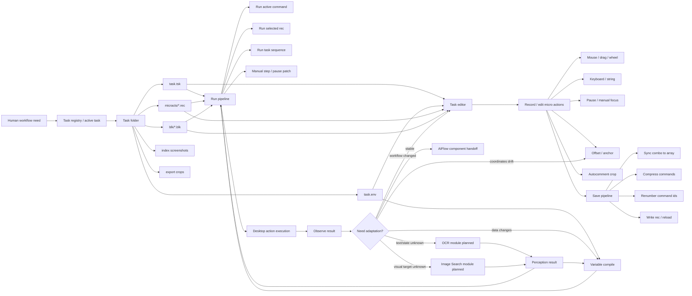
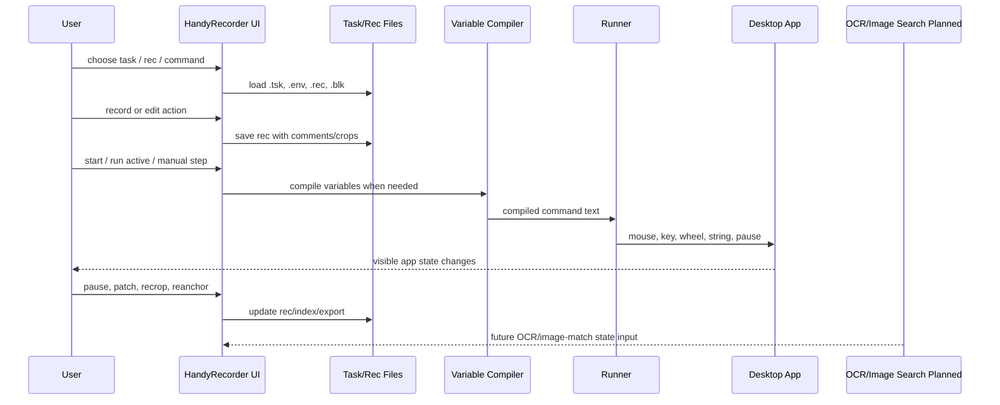
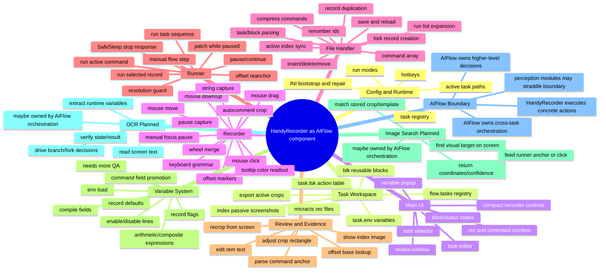

# HandyRecorder Pipeline and Module Mind Map

Date: 2026-08-25

Purpose: discussion map after several months of real use. This is not a frozen spec. It is a working picture of what HandyRecorder does now, what hurts, and where Variable System, Image Search, and OCR should enter before AIFlow integration becomes stable.

## Pipeline Stream

## Runtime Loop

## Module Mind Map

## Module / Function Ownership

| Area | Source files | Current responsibility | Notes |
|---|---|---|---|
| Config/runtime | `config.au3`, `main.au3` | INI defaults, hotkeys, task paths, run mode | Mostly working, docs need update |
| Task workspace | `config.au3`, `filehandler.au3`, `main.au3` | Registry, active task, `.tsk`, `.env`, rec/block folders | Current core model |
| Record editing | `filehandler.au3`, `main.au3` | Command array, combo sync, save, compress, renumber | Important stable base |
| Recording | `recorder.au3` | Mouse/key/wheel/string/pause/offset capture | Needs real-world bug notes added |
| Playback | `runner.au3` | Active command, rec, task, pause, patch, SafeSleep | Manual focus and pause paths need regression tests |
| Review/autocomment | `main.au3`, `recorder.au3` | Screenshot crop, rem labels, recrop, review UI | Key usability feature |
| Variables | `filehandler.au3`, `main.au3`, `runner.au3` | Env load, compile, field promotion, execution | Implemented first pass; not fully proven |
| Image Search | planned | Visual target search from screen or stored crops | Not yet active module |
| OCR | planned | Text/state extraction from screen | Not yet active module |
| AIFlow integration | future boundary | Higher-level orchestration and decision logic | Should wait for variable stabilization |

## What To Report From Real Use

Use this list to collect your months-of-use findings before we redesign anything:

1. Recording pain: missed clicks, wrong drag threshold, bad key grammar, wheel noise, accidental UI capture.
2. Playback pain: stop response, pauses, focus loss, VM/Citrix behavior, wrong next command, resolution mismatch.
3. Editing pain: combo sync surprises, insert position, save/reload behavior, task editor selection, rec/block insertion.
4. Review pain: crop too small/large, wrong anchor, rem naming, index clutter, recrop accuracy.
5. Offset pain: base drift, reanchor timing, confusing marker commands, review crop lookup.
6. Variable pain: hard-coded coordinates/text, repeated values, per-task/per-rec values, enable/disable needs.
7. OCR needs: what text must be read, where it appears, how reliable it must be, what decisions depend on it.
8. Image Search needs: what visual targets move, what screenshots/templates already exist, acceptable match confidence.
9. AIFlow needs: which decisions are task-level, which are cross-task, and where human confirmation is needed.

## Immediate Discussion Questions

- Which failures happened most often in real use: recording, playback, editing, visual recognition, or task organization?
- For OCR, do you mainly need verification, data extraction, or branching decisions?
- For Image Search, do you mainly need to find buttons/icons, reanchor coordinates, or compare screen states?
- Should perception modules live inside HandyRecorder for fast local action, or in AIFlow so the recorder stays simple?
- What is the smallest workflow that proves the next version is better than the current one?
